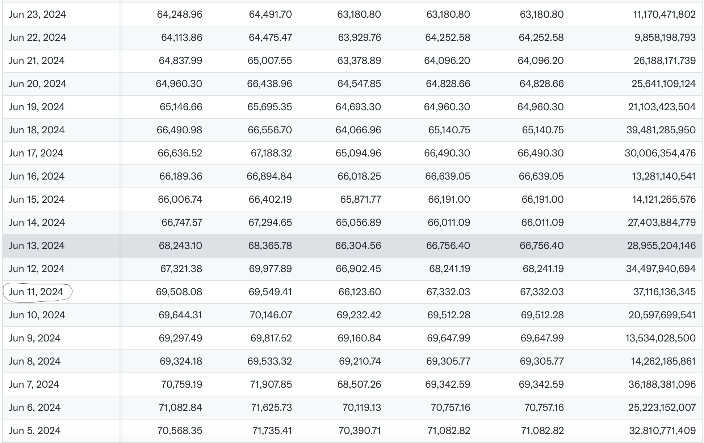

# Bitcoin Price Prediction Using LSTM 
 
## We scraped and analysed BTC-USD hourly price movements using LSTM architecture and created a model which can predict prices for the next hour. This was done as a part of a hackathon where one had to create a model to predict prices of any asset class in any market targetting to maximize profits.

## Table of Contents
- [Introduction](#introduction)
- [Dataset](#dataset)
- [Preprocessing](#preprocessing)
- [Modeling](#modeling)
- [Results](#results)
- [Future Work](#future-work)
- [Usage](#usage)
- [Requirements](#requirements)

## Introduction
The goal of this project is to predict the closing price of Bitcoin using historical price data. We use deep learning techniques to train a model that can forecast future prices based on past trends.

## Dataset
We use historical BTC-USD price data from Yahoo Finance. The dataset includes the following features:
- Date
- Open
- High
- Low
- Close
- Volume
- Adj Close

## Preprocessing
Data preprocessing steps include:
- Loading the dataset using `pandas_datareader`.
- Handling missing values.
- Scaling the data for better model performance.
- Creating sequences of 60 days of historical data to predict the next day's price.

## Modeling
We use a Long Short-Term Memory (LSTM) neural network for time series prediction. The model architecture includes:
- LSTM layers
- Dense layers
- Dropout for regularization

## Results
The model predicts the closing price of Bitcoin with reasonable accuracy. Example predictions and visualizations are provided in the notebook.

## Future Work
To improve the model, the following steps can be considered:
- Increase or decrease the number of hidden layers.
- Adjust the number of units per layer.
- Experiment with different types of layers and activation functions.
- Train the model with different batch sizes.
